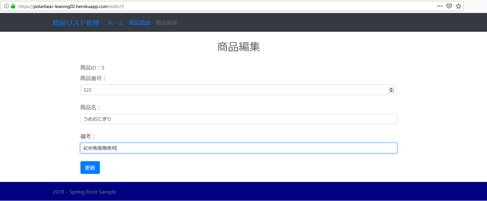
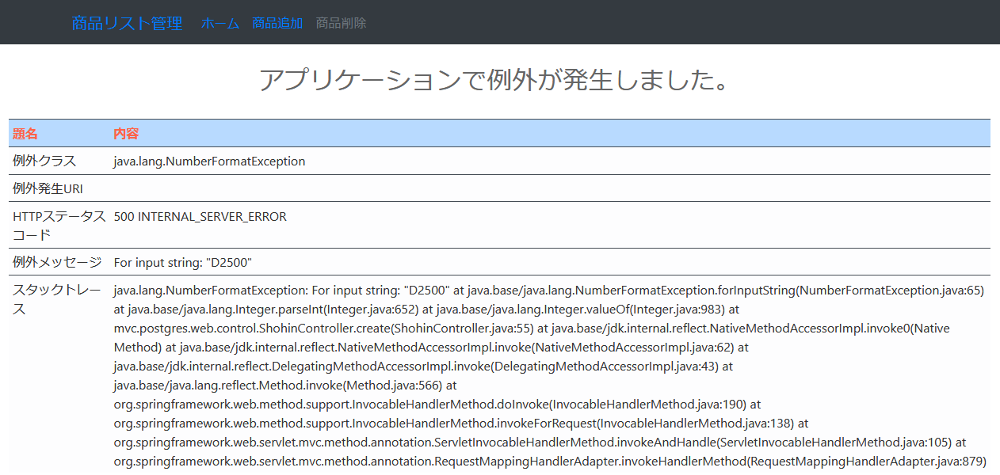
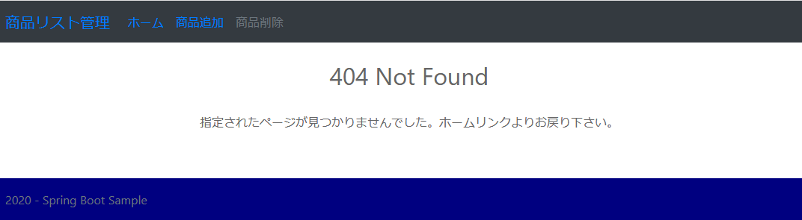
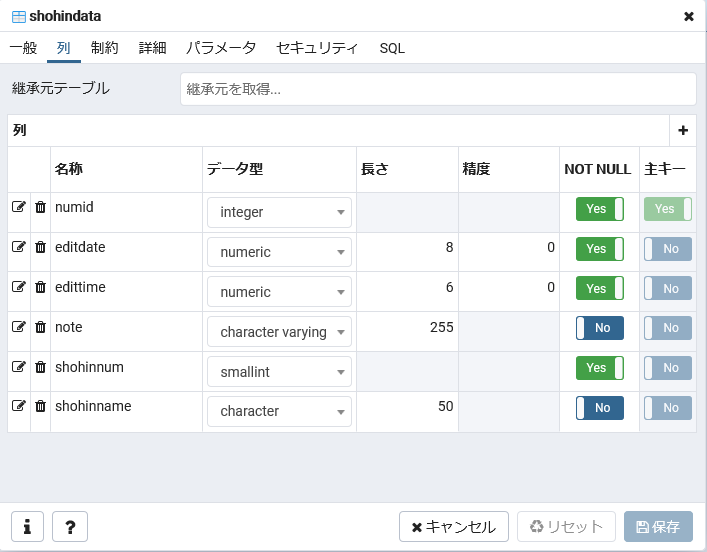

## :leaves: SpringBootでJPA(O/R マッパー)を使いPostgreSQLとの読み書きサンプル

#### 環境
```
開発環境：Eclipse 2020-09 R(4.17.0) Pleiades Spring Tool Suite プラグイン 4.8.1
言語：Java 11
デベロッパーSDK：Adopt OpenJDK 11.0.9
フレームワーク：Spring Boot 2.4.0
-Spring Framework 5.3.1
-サーブレットエンジン：Apache Tomcat 9.0.39
-テンプレートエンジン：Thymeleaf 3.0.11 RELEASE
-データベース接続：PostgreSQL JDBC 4.2 Driver 42.2.18
-O/R マッパー フレームワーク：Hibernate ORM 5.4.23.Final + JPA 2.2
-ログイン認証:Spring Security 5.4.1
ログイン認証：Form認証
データベース：PostgreSQL 13.1
-データベース管理ツール：PgAdmin 4.28
ビルドツール：Apache Maven 3.6.3
CSSテンプレート：Bootstrap 4.5.3
```

### [Herokuサービスで確認](https://polarbear-leaning02.herokuapp.com/)
サンプルアプリ。ユーザー名：user、パスワード：passuser  
※Dynosがスリープから復帰起動するため表示に時間がかかります(無料版のため)。   
30分で再びスリープに入ります。  
※HerokuのPostgreSQLは2020/04/21現在、バージョンは11.7です。  

#### 画面・イメージ／一覧  
  

#### 画面・イメージ／更新  
  

#### 画面・イメージ／例外  


#### 画面・イメージ／ページなし  


#### データベース管理ツール・イメージ／テーブル  
  
  