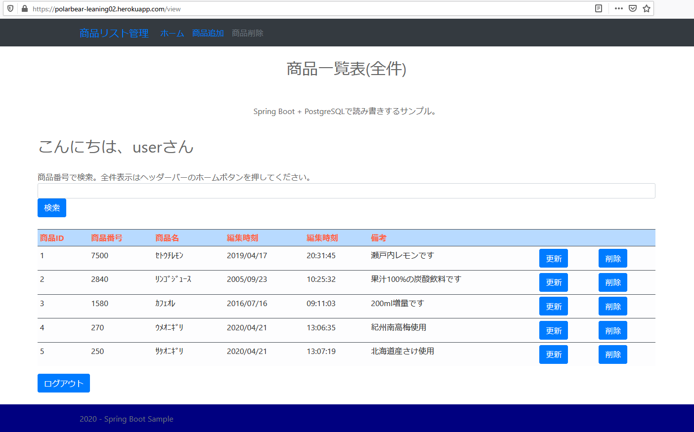

## :leaves: SpringBootでJPA(O/Rマッピング)を使いPostgreSQLとの読み書きサンプル

#### 環境
```
開発環境：Eclipse 2021-06 R(4.20.0) Pleiades Spring Tool Suite プラグイン 4.11.0
言語：Java 11
デベロッパーSDK：Adopt OpenJDK 11.0.11 + 9
フレームワーク：Spring Boot 2.5.2
-Spring Framework 5.3.8
-サーブレットエンジン：Apache Tomcat 10.0.0-M1
-テンプレートエンジン：Thymeleaf 3.0.12 RELEASE
-データベース接続：PostgreSQL JDBC 4.2 Driver 42.2.20
-O/R マッピング フレームワーク：Hibernate ORM 5.4.32.Final + JPA 2.2.3
-ログイン認証:Spring Security 5.5.1
ログイン認証：Form認証
データベース：PostgreSQL 13.3
-データベース管理ツール：PgAdmin 5.4
ビルドツール：Apache Maven 3.8.1
CSSテンプレート：Bootstrap 5.0.2
```

### [Herokuサービスで確認](https://polarbear-leaning02.herokuapp.com/)
サンプルアプリ。ユーザー名：user、パスワード：passuser  
※Dynosがスリープから復帰起動するため表示に時間がかかります(無料版のため)。   
30分で再びスリープに入ります。  
※HerokuのPostgreSQLは2020/04/21現在、バージョンは11.7です。  

#### 画面・イメージ／一覧  
  

#### 画面・イメージ／更新  
  

#### 画面・イメージ／例外  


#### 画面・イメージ／ページなし  


#### データベース管理ツール・イメージ／テーブル  
  
  